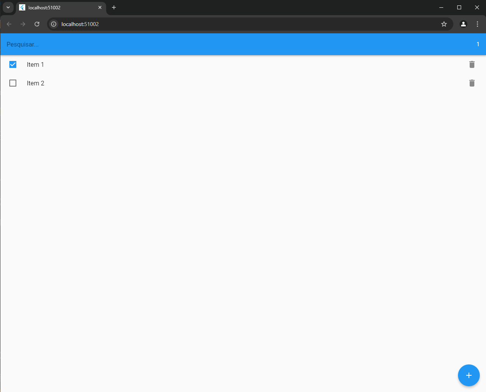

## Descrição

`mobx_cart_list` é um projeto que demonstra o uso do gerenciador de estado [MOBX](https://mobx.js.org/) para aplicações em Dart e Flutter. Este exemplo ilustra como utilizar o `ObservableList` com objetos observáveis, especificamente a classe `ItemModel`, para gerenciar uma lista de itens.

## Exemplos de Uso

O projeto fornece uma demonstração prática da utilização de MOBX para gerenciar o estado da aplicação, permitindo adicionar, remover e listar itens de forma reativa. O código é estruturado para mostrar como o estado da lista pode ser atualizado e refletido automaticamente na interface do usuário.

## Imagem de Exemplo

Aqui está uma visão geral de como a aplicação se parece em execução:

